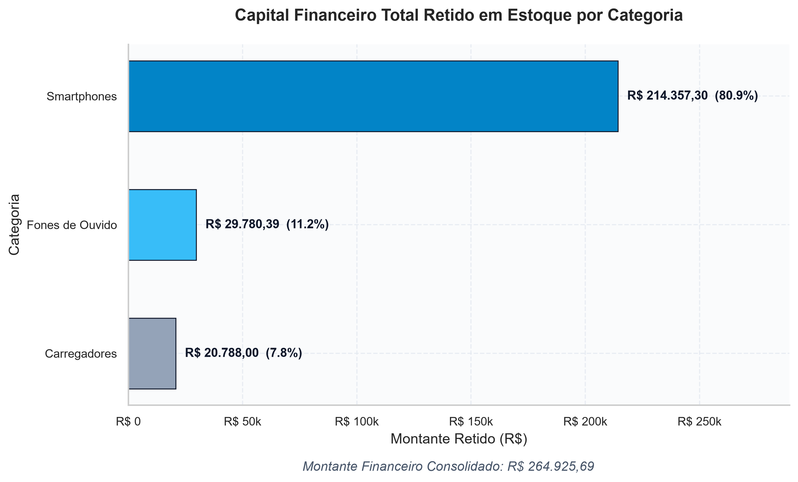
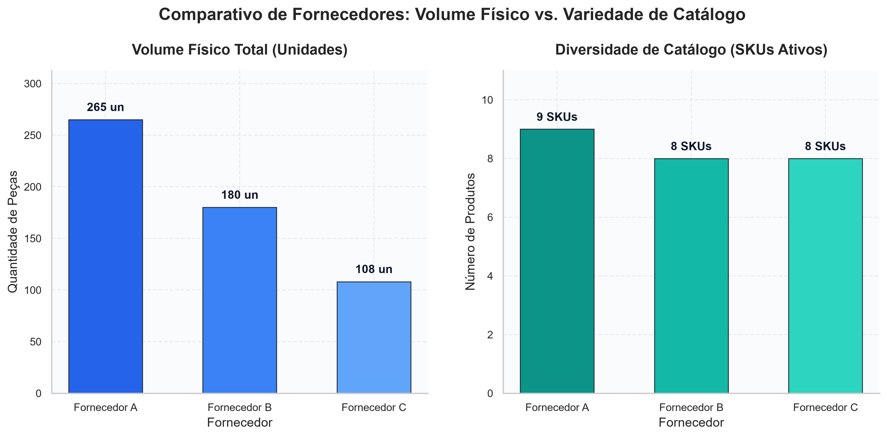
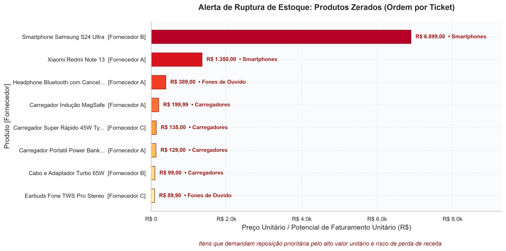

# 📦 Sistema Automatizado de Limpeza, Análise e Monitoramento de Estoque


Solução modular e automatizada de **Engenharia e Análise de Dados** desenvolvida em **Python** e **Pandas**, com suporte a **Matplotlib** e **Seaborn** para visualização executiva e **Git** para versionamento. O sistema realiza data profiling, higienização, mapeamento para schema canônico, cálculo de indicadores financeiros e detecção de rupturas de estoque a partir de fontes de múltiplos fornecedores.

---

## 🎯 Problema de Negócio

Em ambientes de varejo e comércio eletrônico com múltiplos parceiros de abastecimento, a centralização dos dados de estoque enfrenta obstáculos críticos devido à **heterogeneidade e falta de governança na origem dos arquivos**. 

Neste projeto, três fornecedores distintos (**Fornecedor A, Fornecedor B e Fornecedor C**) fornecem diariamente os seus catálogos de produtos com graves problemas de qualidade de dados:

* **Formatos e Schemas Distintos:** Nomes de colunas despadronizados para representar as mesmas entidades (por exemplo: `id_produto` vs `codigo_item` vs `sku`; `preco_unitario` vs `Preco` vs `valor_brl`; `qtd_estoque` vs `Quantidade` vs `estoque_disponivel`).
* **Erros de Digitação e Variações Textuais:** Nomes de produtos e departamentos escritos com erros de digitação e caixas variadas (`"Smartfone"`, `"smarthphone"`, `"FONE DE OUVIDO"`, `"audio / fone ouvido"`, `"Indussão"`, `"bluetoth"`).
* **Divergências de Moeda e Tipos Corrompidos:** Preços inseridos como texto com símbolo de moeda (`"R$ 4.299,00"`), separadores de milhar com ponto e decimais com vírgula, strings com instruções não numéricas (`"consultar"`) e quantidades acompanhadas de texto (`"15 un"`, `"30.0"`).
* **Registros Nulos e Valores Inválidos:** Itens com preços ausentes ou zerados (`0,00`), campos de categoria vazios (`NaN`) e quantidades em estoque negativas (`-3`, `-10`, `-1`) ou registradas como `"SEM ESTOQUE"`.

**Objetivo:** Construir um pipeline resiliente e auditável em Python que converta arquivos heterogêneos e inconsistentes em uma base única, fidedigna (*Single Source of Truth*) e preparada para inteligência de negócio.

---

## 🏗️ Estrutura de Pastas e Arquitetura

O pipeline segue um fluxo lógico desacoplado e modular:

```text
[dados_brutos/] (Fontes Despadronizadas)
       │
       ▼
[exploracao_diagnostico.py] (Profiling: dtypes, nulos, cabeçalhos)
       │
       ▼
[limpeza_padronizacao.py] (ETL: Schema Canônico, Regex, Coerção, Dedução)
       │
       ▼
[dados_processados/estoque_consolidado_limpo.csv] (Base Canônica SSOT)
       ├──▶ [analise_negocio.py] ──▶ [dados_processados/resumo_kpis_categoria.csv]
       │
       └──▶ [visualizacao_graficos.py] ──▶ [graficos/*.png] (Gráficos Executivos 300 DPI)
```

### Estrutura do Diretório do Projeto:
```text
sistema-automacao-processamento-python/
│
├── dados_brutos/                          # Arquivos CSV brutos enviados pelos fornecedores
│   ├── fornecedor_a.csv
│   ├── fornecedor_b.csv
│   └── fornecedor_c.csv
│
├── dados_processados/                     # Dados tratados e resumos analíticos exportados
│   ├── estoque_consolidado_limpo.csv
│   └── resumo_kpis_categoria.csv
│
├── graficos/                              # Gráficos executivos gerados em alta resolução
│   ├── valor_por_categoria.png
│   ├── distribuicao_estoque_fornecedor.png
│   └── alerta_ruptura_estoque.png
│
├── gerar_dados_brutos.py                  # Script de simulação de dados e inconsistências
├── exploracao_diagnostico.py              # Script de diagnóstico exploratório e profiling
├── limpeza_padronizacao.py                # Pipeline de higienização, mapeamento e consolidação
├── analise_negocio.py                     # Cálculo de KPIs financeiros e detecção de rupturas
├── visualizacao_graficos.py               # Visualização e renderização gráfica executiva
│
├── requirements.txt                       # Arquivo de dependências do ambiente
├── .gitignore                             # Regras de exclusão do Git
└── README.md                              # Documentação principal do projeto
```

---

## ⚙️ Decisões de Engenharia de Dados

1. **Padronização para Schema Canônico:**
   * Mapeamento explícito das colunas heterogêneas para o padrão unificado: `id_produto`, `produto`, `categoria`, `preco`, `estoque`, `fornecedor`.
   * Preservação da rastreabilidade da origem através da injeção do metadado de fornecedor.

2. **Coerção Numérica e Limpeza de Preços:**
   * Utilização de expressões regulares para remoção do prefixo monetário `R$` e de separadores de milhar no padrão brasileiro (`.` antecedendo 3 dígitos).
   * Substituição da vírgula decimal pelo ponto flutuante padrão do Python.
   * Aplicação de `pd.to_numeric(..., errors='coerce')` para converter textos (ex.: `"consultar"`) em `NaN`.
   * **Auditoria de Descarte:** Registros com preços nulos ou `<= 0` (como itens em revisão a `0,00`) foram removidos com log detalhado, uma vez que preços financeiros não devem ser inventados sem regras de negócio acordadas.

3. **Tratamento de Estoques e Valores Negativos:**
   * Limpeza de sufixos de texto (ex.: `"15 un"`) e mapeamento de valores como `"SEM ESTOQUE"` para `0`.
   * Coerção numérica e retificação de quantidades negativas (`-3`, `-10`, `-1`) para `0` através de `.clip(lower=0)`, saneando inconsistências físicas de estoque.

4. **Normalização de Categorias com Expressões Regulares (Dedução Inteligente):**
   * Normalização de caixas e caracteres para um conjunto fechado de **3 categorias canônicas**: `Smartphones`, `Fones de Ouvido` e `Carregadores`.
   * Quando o campo de categoria se encontrava nulo (`NaN`) ou genérico, o pipeline deduziu automaticamente a categoria através de padrões textuais e expressões regulares aplicados ao nome do produto (ex.: termos como *"Galaxy"*, *"iPhone"*, *"Edge"* e *"Redmi"* classificam automaticamente o produto como *Smartphones*).

---

## 📊 Indicadores e Métricas Obtidas

A base de dados higienizada consolidou **25 produtos ativos** (com 5 descartes justificados por ausência de preço válido):

### 1. Resumo Executivo Geral
| Indicador de Negócio | Valor Consolidado |
| :--- | :--- |
| **Total de SKUs Válidos** | 25 produtos |
| **Volume Total Físico em Estoque** | 553 unidades |
| **Preço Médio Global** | R$ 1.482,00 |
| **Capital Total Retido em Estoque** | **R$ 264.925,69** |
| **Itens em Ruptura de Estoque (Estoque Zerado)** | 8 SKUs |

### 2. Concentração de Valor por Categoria
| Categoria | SKUs | Unidades em Estoque | Preço Médio | Capital Retido (R$) | Participação (%) |
| :--- | :---: | :---: | :---: | :---: | :---: |
| 📱 **Smartphones** | 9 | 65 | R$ 3.816,03 | **R$ 214.357,30** | **80,91%** |
| 🎧 **Fones de Ouvido** | 9 | 218 | R$ 210,88 | R$ 29.780,39 | 11,24% |
| 🔌 **Carregadores** | 7 | 270 | R$ 115,41 | R$ 20.788,00 | 7,85% |

> **Destaque Estratégico:** Os **Smartphones** representam **80,91% de todo o capital imobilizado** da operação, embora correspondam a apenas 11,7% das unidades físicas totais.

### 3. Identificação de Rupturas de Estoque (Alerta de Reposição)
Foram identificados **8 produtos com estoque zerado**, demandando reposição imediata para evitar perda de receita, com destaque para itens premium:
* **Samsung Galaxy S24 Ultra** (`B-109` - Fornecedor B): Preço Unitário de **R$ 6.899,00**
* **Xiaomi Redmi Note 13** (`FA008` - Fornecedor A): Preço Unitário de **R$ 1.350,00**
* **Headphone Bluetooth ANC** (`FA006` - Fornecedor A): Preço Unitário de **R$ 389,00**

---

## 📈 Visualização Gráfica

Gráficos executivos renderizados a **300 DPI** com `matplotlib` e `seaborn`, utilizando paleta profissional e formatação em moeda nacional:

### 1. Valor Financeiro por Categoria


### 2. Comparativo de Fornecedores (Volume Físico vs. SKUs Ativos)


### 3. Alerta de Ruptura de Estoque (Produtos Zerados por Ticket)


---

## 🚀 Instruções de Execução

Siga o passo a passo abaixo para clonar, configurar e executar todos os estágios do pipeline:

### 1. Clonar o Repositório
```bash
git clone https://github.com/paulocid95/pipeline-analise-estoque-python.git
cd pipeline-analise-estoque-python
```

### 2. Configurar o Ambiente Virtual
* **No Windows (PowerShell):**
  ```powershell
  python -m venv .venv
  .venv\Scripts\Activate.ps1
  ```
* **No Linux / macOS:**
  ```bash
  python3 -m venv .venv
  source .venv/bin/activate
  ```

### 3. Instalar Dependências
```bash
pip install -r requirements.txt
```

### 4. Executar os Scripts na Ordem Correta

Execute os scripts sequencialmente para replicar a esteira completa:

```bash
# 1. Simular e criar os dados brutos com inconsistências (pasta dados_brutos/)
python gerar_dados_brutos.py

# 2. Executar o diagnóstico exploratório de dados e profiling de inconsistências
python exploracao_diagnostico.py

# 3. Executar o pipeline de limpeza, padronização e consolidação (salva em dados_processados/)
python limpeza_padronizacao.py

# 4. Calcular métricas financeiras de negócio, alertas de ruptura e exportar KPIs
python analise_negocio.py

# 5. Gerar e salvar os gráficos executivos em alta resolução (pasta graficos/)
python visualizacao_graficos.py
```

---

## 👨‍💻 Autor

Desenvolvido por **Paulo Cid**  
*Engenharia e Análise de Dados com Python & Pandas*  
GitHub: [@paulocid95](https://github.com/paulocid95)
